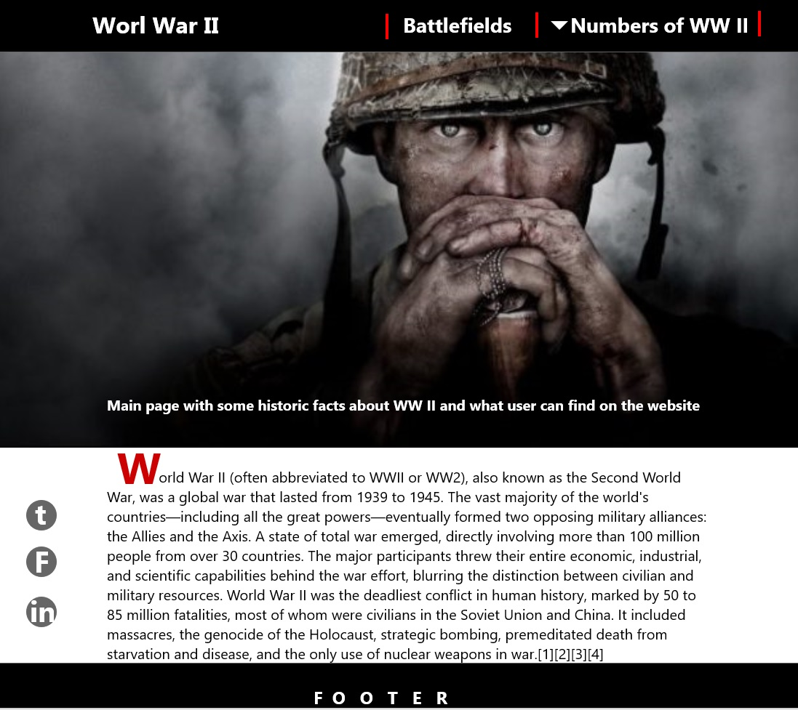
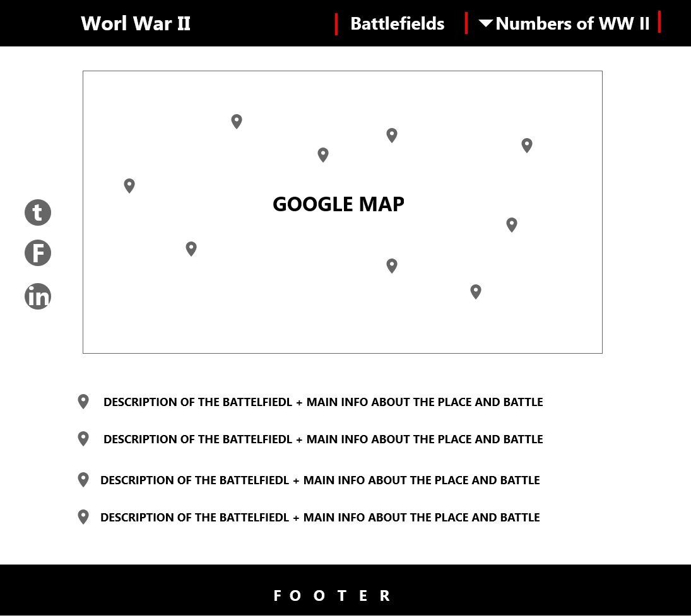
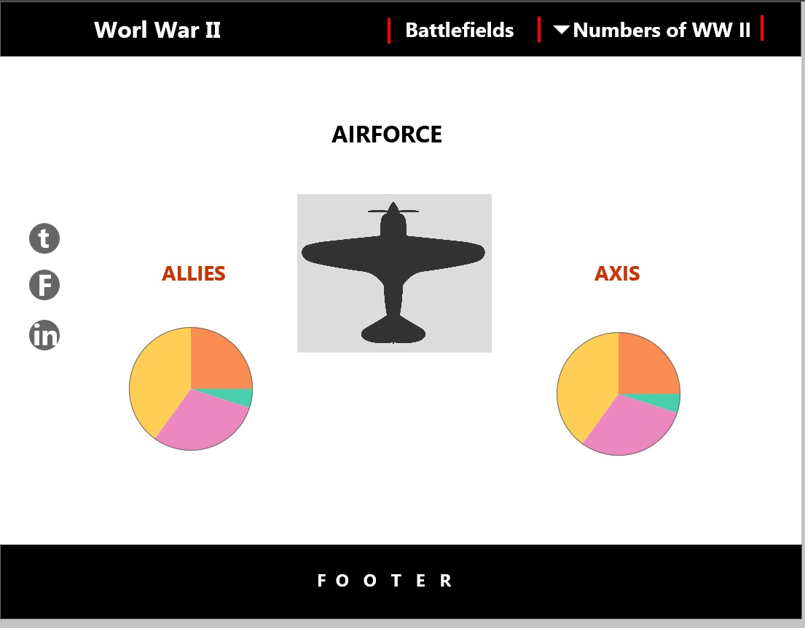

# World War II

Website is dedicated to the Second World War. 
It shows most important information such as battlefiedls, forces and some history information.

## UX

Website is create in a clear form where we can finde information in very easy and fast way. 
Charts are interactive and user can pick the most important for him data in clear simply way.
Design of it is mixture of a news and dahsboard website.

## Features

- Google Map API shows marker on map and hold popup windows with info. It's linked to geojson file that holds data
- Interactive charts, user can pick, in what data is interested and filter charts and data
- floating social media links on the side

## Technologies Used

- HTML 5
- CSS
- JavaScript
- Bootstrap v3.3.7
- Fontawesome v5.4.1
- jQuery v3.3.1
- queue.js
- crossfilter
- d3.js
- dc.js
- charts.js
- Mockplus

## Testing

## Deployment

Hosted on github page.
Published at https://chodar89.github.io/world-war-ii/

## Credits

### Content

Main text and information about the war was copied from wikipedia.
Battlefields are from wikipedia. Main picture in index page is a poster from "Fury" movie 

### Media

### Acknowledgements

- World War II is a big part of my history as my family take part in this. My grandparent stories about WW II times inspired me to create this website.
